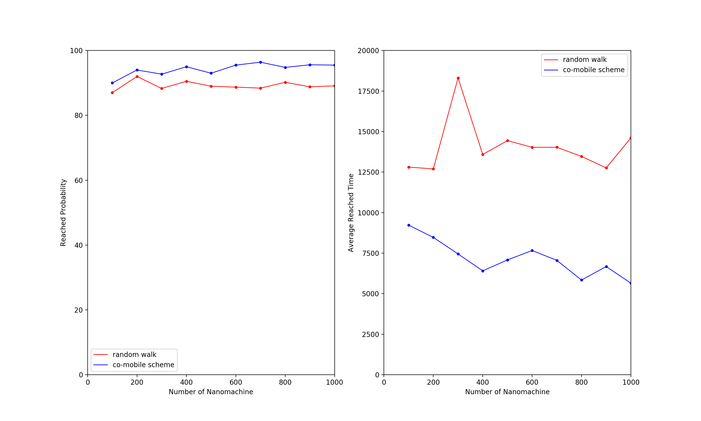
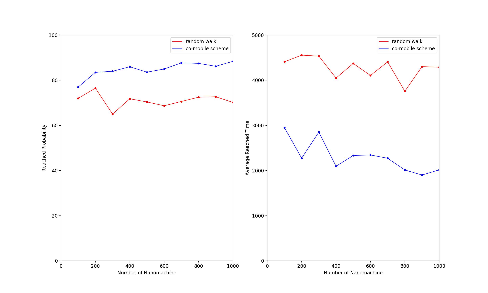

# Co-mobile Scheme for Molecular Communication

author: gexin

email: gexin@std.uestc.edu.cn

[TOC]

## 介绍

本项目是**分子通信中基于趋化效应的协同移动策略**仿真验证代码

/src：源代码

/pics：仿真结果图

/data: 结果数据，用于数据分析及画图，一般不上传至github

* 分子通信

  使微米及纳米尺度下的纳米机进行通信，纳米机可以是人工的，可以是生物的，可以是基于人工生物改造的。在这个尺度下，传统的电磁波通信手段失效，需要研究其他通信手段

* 趋化效应

  在生物界中，不少微生物自带**趋利避害**功能，若能感知到对自己有利的物质，则会向物质浓度高的地方移动，称为趋化效应。分子通信中被研究的最多的是基于趋化效应的分子通信。

* 协同移动策略

  设想在某种生物医学场景中，需要向人体某部位注射纳米机。在目标区域在人体内部，需要纳米机移动一段距离后才能到达。那么设计什么样的策略能让更多的纳米机到达目标区域，到达目标区域的时间花的更少？

  

## 使用及参数说明

下列参数为某次实验的参数设置，可以更改

| 参数名          | 类型   | 值                        | 文件            | 说明                                                         |
| --------------- | ------ | ------------------------- | --------------- | ------------------------------------------------------------ |
| now             | int    | 0                         | main.cpp        | 描述现有时间，或迭代次数                                     |
| num_nanomachine | int    | 100                       | main.cpp        | 纳米机数量                                                   |
| is_comobile     | bool   | false                     | main.cpp        | 是否使用本项目提出的协同移动策略                             |
| max_time        | int    | 2000                      | main.cpp        | 最大迭代次数，超过此值后纳米机停止移动，数据收集开始         |
| B_timeout       | int    | 10                        | main.cpp        | 释放物质B的时间间隔，也就是满足释放条件情况下每10次迭代释放一次 |
| B_rangeout      | int    | 200                       | main.cpp        | 检测物质B的阈值，距离表示，距离释放点距离200内可以检测到浓度 |
| propotional_coe | double | 1.0                       | main.cpp        | 第二种停止迭代的条件，达到总纳米机数量*propotional_coe时停止迭代 |
| init_distance   | double | 900.0                     | main.cpp        | 初始化时纳米机距离目标区域的距离                             |
| rand_seed       | int    | 6                         | Nanomachine.cpp | 随机数种子，为保证结果可复现设置为常数                       |
| single_step     | double | 2.0                       | Nanomachine.cpp | 纳米机每次迭代时的移动步长                                   |
| dist_threashold | double | 50.0                      | Nanomachine.cpp | 目标区域是一个圆，这是半径长度                               |
| A_threashold    | double | A_CONCENTRATION_MAX/700.0 | Nanomachine.cpp | A物质检测浓度阈值                                            |
| B_threashold    | double | B_CONCENTRATION_MAX/300.0 | Nanomachine.cpp | B物质检测浓度阈值                                            |
| MAX_X           | double | 2000.0                    | Nanomachine.cpp | X轴范围最大绝对值                                            |
| MAX_Y           | double | 2000.0                    | Nanomachine.cpp | Y轴范围最大绝对值                                            |
| direction_coe   | double | 4.0                       | Nanomachine.cpp | 进行随机游走时的角度随机范围，需大于等于1.0                  |
| num_direction   | int    | 12                        | Nanomachine.cpp | 浓度检测方向的数量                                           |

## 性能结果

* 使用协同移动策略比不使用协同移动策略，在纳米机到达目标区域的数量，纳米机到达目标区域的平均时间都更优。

  

  

  

在最大迭代次数为10万次的情况下，蓝色线条时使用协同移动策略，红色时不使用协同移动策略

1. 横轴是每次实验时设定的纳米机数量，左图纵轴是纳米机最终到达目标区域百分比，使用策略平均对纳米机到达目标区域百分比会提高5%～10%
2. 使用协同移动策略可以显著降低纳米机到达目标区域的平均时间，并且随纳米机数量增多，下降趋势明显。

图的意义一样，不过上图的最大迭代次数是2万次。所以平均时间已经到达比例有了显著下降。在这种参数设定中，使用协同移动策略和不使用协同移动策略造成的性能差异更加明显。

## 数学模型

### 不使用协同移动策略的二维趋化分子通信模型

这样的移动策略非常简单，在未检测到趋化物质浓度，或检测浓度低于阈值时进行随机游走，在检测到趋化物质后或物质浓度高于阈值时向梯度高的方向移动。

所以分为两个阶段

1. 随机游走阶段
2. 趋化阶段

### 随机游走阶段模型

此时纳米机作布朗运动，也就是随机游走，对于二维随机游走已经研究的比较透彻。

